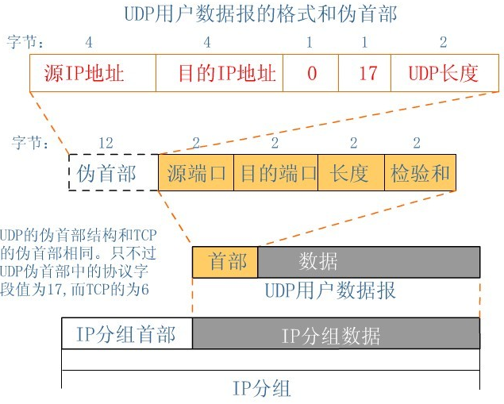
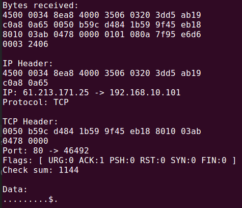
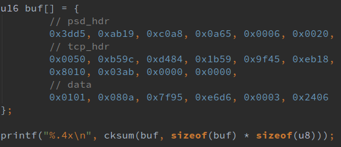
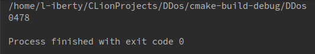

# DDos实现

## 1. 一个问题: 如何计算IP和TCP校验和?
网络层的校验范围仅包括**IP首部的20字节**；传输层的校验范围包括**TCP/UDP伪首部、TCP/UDP首部和后面的数据部分**. 伪首部结构如下图:

伪首部中的"TCP/UDP长度"指的是**TCP/UDP首部 + 后面的数据**的总长度，即TCP/UDP报文的长度. 为了证实，我随意抓取了网络中的一个数据包:

并自行计算了校验和:

伪首部的"TCP长度"字段为0x0020, 即**20字节的TCP首部加上12字节的数据**. 测试结果显示`cksum(...)`函数和校验和计算范围均正确.

## 2. problemo
测试时我试图通过代码手动完成TCP三次握手，只有测试成功才能继续测试DDos，但是三次握手似乎必须在内核中完成.
