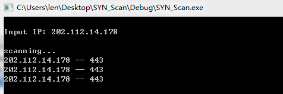
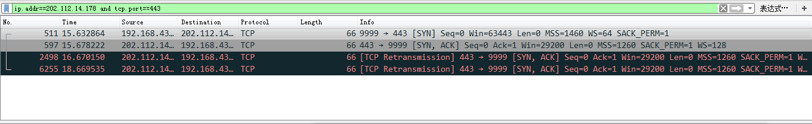
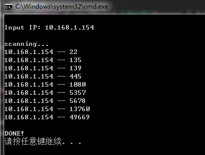

# SYN端口扫描

## 原理
TCP连接时client与server先完成三次握手，扫描程序构建第一次握手的数据包(client发送给server的SYN报文)并发送到指定端口，如果能收到第二次握手的数据包(server发送给client的SYN_ACK报文)，则说明该端口处在监听状态.

## 实现细节
### TCP首部的构建
大多数资料对*选项(Options)*字段没有说明，因此我通过wireshark抓包分析，定义了该字段并完成填充.

## 运行结果

由于server发送SYN_ACK报文后未收到client回复的ACK报文，于是进行超时重传.

- 添加重传判断后:
