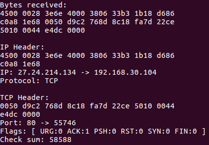
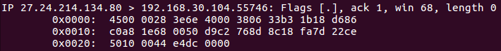
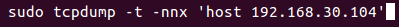

# 原始套接字之简易网络嗅探器
创建原始套接字(SOCK_RAW), 通过recvfrom接收来自**网络层**的数据包, 并使用自定义的TCP、IP Header数据结构进行数据解析.

自编写的sniffer抓包结果:

Linux自带的tcpdump抓包结果:

**注：**tcpdump的命令参数:

`192.168.30.104`为本机IP

## More
数据包的字节排序未采用小端序，需要另行解析
