# 实验: 使用自编写的sniffer观察TCP连接的全过程
> 为防止干扰，实验时需要关闭本机的网络连接

## TCP建立连接: 三次握手

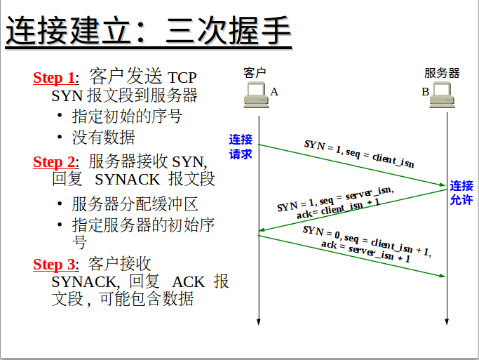

## TCP Header 的格式

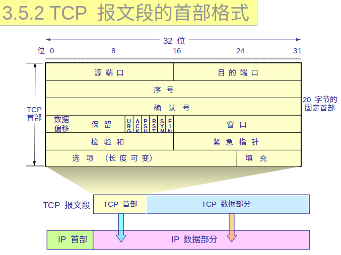

## 具体过程
> 本实验中服务端在本机的9999号端口监听

### 1. 客户端调用`connect`函数激发三次握手

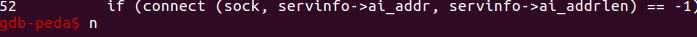

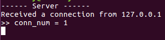

**sniffer抓包结果:**

#### Step 1

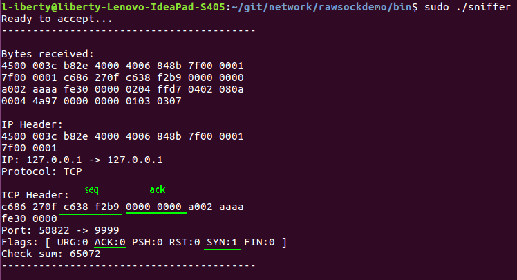

**参数:**

* `序号` = 0xc638f2b9
* `SYN` = 1
* `确认号` = 0, 同时标志域中`ACK`为0, 表示确认号字段的值(0)无效；之后`ACK`标志位始终为1, 因为第一次握手后TCP Header的确认号字段必然是有效的

#### Step 2

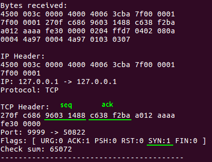

**参数:**

* `序号` = 0x96031488
* `确认号` = 0xc638f2b9 + 1 = 0xc638f2ba
* `SYN` = 1

#### Step 3

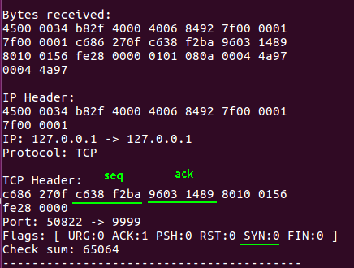

**参数:**

* `序号` = step2中客户端发送给服务端的确认号`0xc638f2ba`
* `确认号` = step2中客户端发送给服务端的序号+1, 即`0x69031488 + 1 = 0x96031489`
* `SYN` = 0

至此，三次握手完成. 观察抓包结果发现.

### 2. 三次握手完成，TCP连接建立，客户端与服务端进行通信

客户端发送数据，服务端接收数据并返回消息

**客户端:**

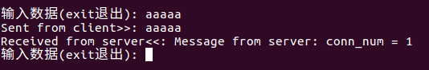

**服务端:**

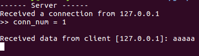

**sniffer抓包结果:**

客户端发送字符串`"aaaaa\n"`；并发送确认号`0x0c1f2185`

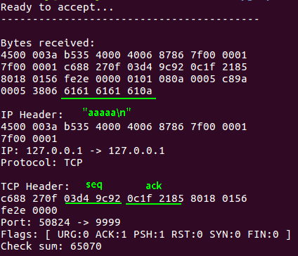

服务端接收数据并返回字符串`"Message from server: conn_num = 1"`; 并将客户端要求的确认号`0x0c1f2185`放在序号字段反馈回去，客户端收到后知道分组没有丢失; 同时发送确认号`0x03d49c98`.

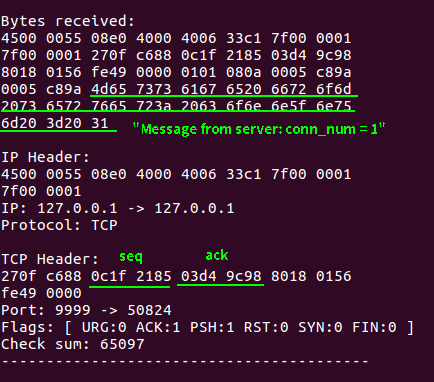

客户端接收报文，将服务端要求的确认号`0x03d49c98`放在序号字段返回. 至此，通信成功结束.

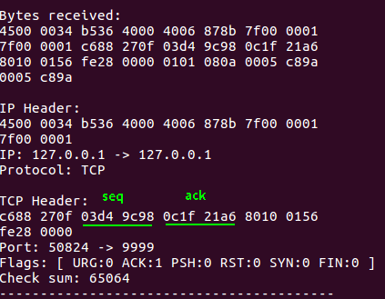

## 3. 断开连接：用户输入"exit"，客户端调用`close`函数关闭连接

### 连接关闭的过程

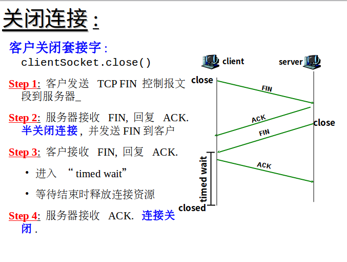

#### step1
客户端 -> 服务端

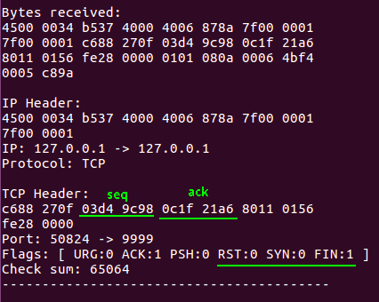

#### step2
服务端 -> 客户端

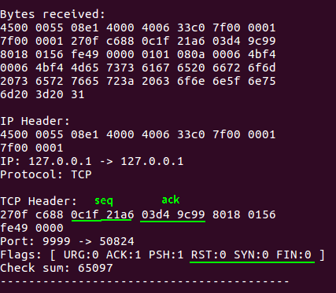

#### step3
服务端 -> 客户端

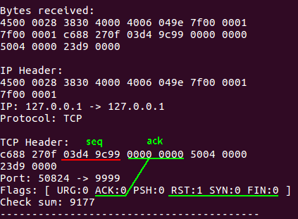

#### step4
服务端接收`ACK`关闭连接，本步骤无分组交换